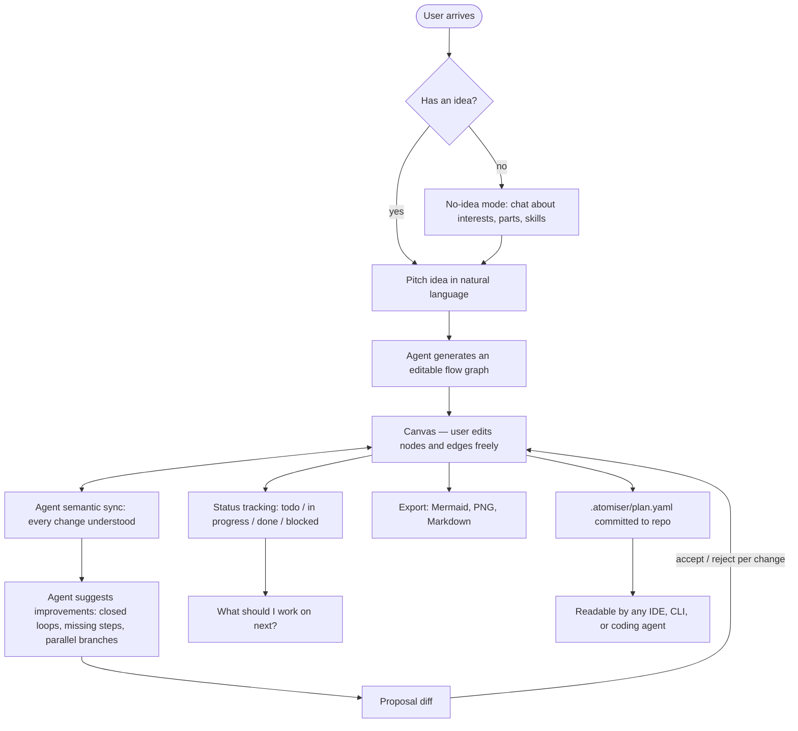
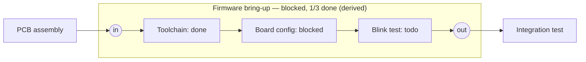

# Atomiser — Project Specification

*An AI-native flowgraph editor that turns ideas into living, actionable project plans.*

**One-liner:** Describe your project, get a flow graph, and edit it together with an agent that actually understands your edits.

---

## How Atomiser Works



---

## 1. Vision

### The origin / problem

Nearly every project starts with a flowchart — and today that flowchart is a dead artifact. It gets drawn once (Miro, Excalidraw, a whiteboard) and then sits untouched while the real work happens elsewhere. Atomiser makes the flowchart the **living interface** between a person's intent and an AI agent: generated from a pitch, co-edited over the project's life, aware of progress, and readable by the rest of the toolchain.

### Beyond "projects"

The model generalizes to any *operation* — anything with steps. Projects are the entry point, not the ceiling. (Positioning note: do **not** market this generality early — see §3.)

### The load-bearing core

The **bidirectional sync loop** — a graph the agent genuinely understands and co-edits — is the spine of the product. Idea generation is the entry point to it; tracking is what it matures into; the repo file is how the rest of the world reads it. Every feature in this spec either exercises the sync loop or hangs off it.

---

## 2. Product Concept

### Core loop

1. **Pitch → Graph.** Describe the idea and intended flow in natural language; the agent generates an editable flow chart with real structure, not a picture.
2. **Bidirectional awareness.** Modify the graph however you want — drag, rename, delete, rewire. The agent understands every change *semantically* and stays in sync.
3. **Proactive suggestions.** The agent recommends structural improvements: a hardware component that would help, a spot where the flow could become a closed-loop pipeline, a missing verification step, branches that could run in parallel.
4. **Proposal diffs.** All agent-generated structure arrives as a reviewable diff — highlighted nodes/edges, accepted or rejected individually, like a PR. The agent never silently rearranges the user's work.
5. **Living status.** Nodes carry todo / in-progress / done / blocked. The graph doubles as an honest tracker and can answer "what should I work on next?" from the real dependency structure.

### Interaction modes (IDE vs Agent)

Two modes, mirroring Cursor's editor/agent split:

- **IDE mode** — the user edits the graph directly: add nodes, connect them, label edges,
  expand a node to edit its content (text / chart / image blocks). Edits apply immediately.
  This is what the v0 editor ships first.
- **Agent mode** — the AI proposes graph changes as accept/reject proposal diffs (§9). User
  edits still apply directly; only agent-authored changes pass through the review gate.

Every node and edge carries an `origin` (`user | agent`) so the two are always distinguishable,
and node content is an ordered list of typed blocks so new content kinds are additive.

### Supporting features

- **No-idea mode.** Users without a concrete idea chat with the agent — or tell it what they have (parts, skills, interests, an ESP32 and a free weekend) — and co-develop a project idea and flow from scratch.
- **Expandable nodes** *(later)*. Each node opens into deeper guidance for that step. Software: example code, implementation notes. Hardware: wiring diagrams, testing code, recommended test points during integration.
- **Decompose / compose** *(later, design settled — §7)*. Break a node into a subgraph; collapse a cluster into a node. Atomise / condense is the product's core verb pair.
- **Graph as repo file** *(§8)*. The plan lives in the repo as `.atomiser/plan.yaml`, readable by any IDE, CLI, or coding agent.

### Long-term vision

- For software: orchestrate multiple AI agents effectively and integrate with the user's CLI — help *execute* the plan, not just draw it. (The repo plan file is the bridge: the file **is** the interface until real orchestration exists.)
- Deep domain content inside nodes (diagrams, code, test procedures) that guides the user through actually doing each step.

### Guiding principle

Not everything gets built at once — shipping everything simultaneously would make this a bad app nobody can use. Start with the basics, then layer up. The deferred list in §5 is a contract, not a backlog of shame.

---

## 3. Positioning

### Audience & wedge

Building for **both software and hardware from the start**, with a general/minimal first version. Hardware may be an underrated wedge long-term: software builders are saturated with AI tooling, while "project flow + wiring diagrams + suggested integration test points" has little competition and a passionate maker community. Avoid marketing the "any operation" generality early — general tools for everything feel like tools for nothing. General engine, concrete wedge messaging.

### Onboarding

No-idea mode ("I have an ESP32 and a free weekend — what can I build?") is likely the strongest first-run experience — arguably more compelling as a hook than pitch-your-idea.

### Competitive landscape & moat

- "AI generates a flowchart" already exists in a dozen tools; general chatbots can sketch plans in text. **The ideation itself is commoditized.**
- The moat is the loop: the graph as a first-class, persistent, manipulable object that the agent reasons over — plus domain-aware structural insight. The "you have no feedback path between testing and design" moment is what makes users feel the app *gets it*, even in v1.
- The repo-file play (§8) adds a second moat: Atomiser as the plan-context layer that makes every AI coding tool smarter about a project.

### Naming

"Atomiser" fits conceptually (breaking work into atomic steps; atomise/condense as verbs) but collides with *atomizer* (spray devices / vapes) for searchability. Check before committing to the name publicly.

---

## 4. v1 Scope (MVP)

Every v1 feature exercises the sync loop — v1 effort concentrates on validating the one thing the product lives or dies on.

1. **Pitch idea → editable flow graph.** Natural-language input produces a real, structured graph (typed nodes, edges, metadata — not a rendering).
2. **Edit graph → agent stays in sync.** Every user modification (add, delete, rename, rewire, move) is semantically understood and reflected in the agent's model of the project.
3. **Proactive structural suggestions.** Graph lints surfaced by the agent: missing feedback loops that could close the pipeline, dead-end or orphan nodes, missing verification/test steps, serial chains that could parallelize. Delivery cadence is a tuning question (see §14) — batched and quiet beats interruptive.
4. **No-idea mode.** Co-develop a project idea from interests and available materials, then flow straight into pitch → graph.
5. **Proposal diffs.** Agent-suggested changes rendered like a PR — accept/reject individually. Cheap to build now, painful to retrofit. *All* agent-generated structure (including future decompositions) flows through this mechanism.
6. **Node status as a first-class field.** todo / in-progress / done / blocked. Enables the tracker identity and "what should I work on next?" answered from the real dependency graph.

### v1.5 (fast follow)

7. **Export from day one(-ish).** Mermaid, PNG, markdown outline. Removes lock-in fear; exports pasted into READMEs and Discords double as marketing.
8. **Graph snapshots / history.** Undo in v1; named checkpoints in v1.5. The agent can reference past states ("you removed the calibration step two weeks ago — it might matter now").
9. **Graph as repo file (one-way export).** See §8.

---

## 5. Deferred Scope

| Deferred item | Why deferred | Where designed |
|---|---|---|
| Node decomposition / composition | Feature deferred; **schema requirements land in v1** | §7 |
| Deep GitHub integration (issues/PRs, webhooks, branch-from-node) | OAuth apps + webhook infra + API edge cases before the sync loop is proven | §8 |
| Deep domain node content (example code, wiring diagrams, test code, test points) | Each is a product of its own; the #1 scope-creep risk | §2 |
| Multi-agent orchestration + CLI integration | The repo plan file is the bridge until then | §8 |
| Real-time collaboration (Yjs/CRDTs, websockets for multiplayer) | Post-traction | — |
| Templates marketplace / social features | Post-traction | — |
| **WebSockets / SSE streaming** (agent edits streaming live into the canvas) | Add when the streaming UX is built; genuinely useful and a good engineering story | §10 |
| **Redis** (caching agent responses, rate-limiting) | Real use cases, premature for v1 — add once there's an actual caching/rate-limit problem | §10 |
| **Docker** | Not needed for a Vercel-deployed app; add on this project for the learning, knowing it's for you, not the app | §10 |

---

## 6. Data Model (v1)

Design rules that must hold from day one:

- **One graph, hierarchy as metadata.** A decomposed node is a `parent_id` relationship inside one graph — never a separate subgraph document. Separate documents would break cross-level reasoning and make cross-level edges impossible.
- **Stable node IDs** (e.g. nanoid), so git diffs of the exported plan file stay readable across renames.
- **Layout is not semantics.** x/y coordinates live in their own table (or app-side only) — never in the exported plan file, so cosmetic nudges don't pollute git diffs.
- **Status is structured**, never free text — rollup and "what's next" depend on it.
- **Flexible metadata via JSONB** — domain-specific fields (hardware vs software) without schema churn.

### Sketch (Drizzle-flavored)

```
graphs      id · owner_id · title · created_at · updated_at
nodes       id (nanoid, stable) · graph_id · parent_id (nullable — REQUIRED in schema even though decomposition is deferred)
            · title · description · node_type (task | decision | milestone | constraint — taxonomy open, §14)
            · status (todo | in_progress | done | blocked) · meta (jsonb)
            · body (jsonb — ordered content blocks: text | image | chart) · origin (user | agent) · timestamps
edges       id · graph_id · source_id · target_id · edge_type (dependency default) · label (nullable) · origin (user | agent)
layouts     node_id · x · y · collapsed (bool)        ← separate from semantics on purpose
snapshots   id · graph_id · name (nullable) · payload (jsonb) · created_at
proposals   id · graph_id · source (user_request | agent_review) · ops (jsonb)
            · status (pending | accepted | rejected | partial) · created_at
```

Retrofitting hierarchy into a flat-only schema later is the expensive path — `parent_id` costs nothing today.

---

## 7. Node Decomposition & Composition *(deferred — design settled)*

Deferred as a feature, but the design is worked out so the v1 data model doesn't paint us into a corner.

### The concept

Right-click a node → **"break this down"** → it expands into a subgraph of child nodes. The inverse also exists: select a messy cluster → **"collapse into one node."** Atomise / condense as the product's core verb pair. Hierarchy is always optional — a tool for when a node feels too big, never a schema the app enforces. Flat graphs are fully supported; people don't only plan top-down, they sketch chaotically and then tidy.



### Stopping rule — what "atomic" means

A node is atomic when it represents **a single work session with an unambiguous done-condition**. "Build firmware" is not atomic; "get the LED blinking over UART" is. The agent should *refuse* to decompose already-atomic nodes — and instead ask what's actually blocking. The refusal is a feature, not a limitation: it's the guardrail against infinite recursion for both the user and the agent.

### Boundary ports solve edge rewiring

When a node with external edges gets expanded, those edges attach to **entry/exit ports** on the decomposed node's boundary; internal children wire to the ports. Collapsed, the ports are invisible and edges simply touch the node. External connections stay stable no matter how the internals are reorganized — which also lets the agent restructure a subgraph without touching anything outside it.

### Status rollup (deterministic, never hand-set)

- *done* when **all** children are done
- *blocked* if **any** incomplete child is blocked
- otherwise *in progress* if anything has started

The collapsed parent is a summary, not just a label ("blocked · 1/3 done"). The top-level graph becomes an honest, zero-maintenance dashboard, and "what's next?" can trace blocked paths down to the atomic culprit.

### UI: two views of one structure

- **Inline expansion** for one level deep — the node grows into a container on the same canvas; surrounding context stays visible.
- **Drill-in navigation** for 2+ levels — double-click enters the subgraph as its own canvas with breadcrumbs back up; boundary ports appear as pinned edge anchors. Interaction pattern to steal: **Figma frame navigation.** (Past one level, inline expansion turns the canvas into soup.)

### Agent's role

- Decomposes **with full graph context** — children reflect constraints stated anywhere in the graph (e.g. "3D printer available" elsewhere → FDM-appropriate enclosure steps). This is a concrete payoff of the single-graph data model.
- Every agent-generated decomposition arrives as a **proposal diff**, never materializes directly — expansion is exactly the moment users most want to prune and reshape.
- **Composition is the same operation in reverse** (assign parent, compute boundary ports from the edges crossing the selection) — nearly free to build alongside decompose, and it's how graphs stay readable as they grow.

### What this requires in v1 *now*

Single-graph data model · optional `parent_id` on every node · status as a structured field. (Already reflected in §6.)

---

## 8. GitHub Integration

### v1.5 — Graph as repo file (one-way export)

Atomiser writes a structured, human-readable plan file into the repo:

```yaml
# .atomiser/plan.yaml
atomiser: 1
project: Smart hydroponics controller
updated: 2026-07-07T18:40:00Z
nodes:
  - id: n_k3d9
    title: Sensor selection
    status: done
    parent: null
    meta: { domain: hardware, notes: "Capacitive soil moisture + DHT22" }
  - id: n_7f3a
    title: Firmware bring-up
    status: blocked          # derived from children
    parent: null
  - id: n_q2m8
    title: Board config
    status: blocked
    parent: n_7f3a
edges:
  - { from: n_k3d9, to: n_7f3a, type: dependency }
```

**Why this is the smart version of "GitHub support":**

- Any IDE, CLI, or coding agent can read it, because it's just a file in the repo — no per-tool integrations to build or maintain.
- Coding agents (Claude Code, Cursor, etc.) already hunt for context files (`CLAUDE.md`, `AGENTS.md`, READMEs). A well-formatted plan file slots directly into that convention — **the flow graph becomes the context document that makes every AI coding tool smarter about the project.** Differentiated position, and the bridge to the orchestration vision without building any of it yet: the file *is* the interface.
- Graph changes become **git-diffable** — plan changes can be reviewed in PRs like code, snapshots can ride on git, and the proposal-diff mechanic rhymes with a workflow developers already trust. (Not the same diff, but the same language — great for how the product *feels*.)

**Design rules:**

1. **One source of truth.** The app owns the graph; the repo file is a projection. One-way export first — true bidirectional YAML sync (hand-edits merged back) is a merge-conflict swamp; revisit only once the format is stable.
2. **Layout stays out of the semantic file.** Nodes/edges/status/hierarchy in the committed file; x/y app-side. Cosmetic nudges must not pollute git diffs.
3. **Stable node IDs** so diffs stay readable across renames.
4. **Domain-neutral format.** Hardware projects live in repos too (firmware, KiCad) — no code-specific assumptions in the schema.

### v2+ — Deep integration (deferred)

Linking nodes to issues/PRs · webhook-driven status (node flips to *done* when its PR merges) · branch creation from nodes. This is the dream version of self-updating status rollup — but it drags in OAuth apps, webhook infrastructure, and GitHub API edge cases. After the sync loop is proven, not before.

---

## 9. Agent Design

### Tool-use loop

The agent manipulates the graph exclusively through **structured tool calls** — this is the core mechanic of the entire product:

```
read:      get_graph                      (serialized semantic graph — no layout)
mutate:    add_node · update_node · delete_node
           add_edge · delete_edge
           set_parent                     (decomposition/composition, later)
```

Flow: user message + serialized graph → agent reasons → mutation tool calls **accumulate into a proposal** → proposal rendered as a visual diff on the canvas → user accepts/rejects per change → accepted ops applied **transactionally** → new graph state becomes the agent's context for the next turn.

Key properties:

- **The agent never mutates directly.** Everything lands as a proposal. (User's own edits apply immediately — the diff gate is for the agent.)
- **User edits are events the agent sees.** Each manual change is fed back into agent context as a semantic event ("user deleted edge enclosure→testing"), which is what makes sync *bidirectional* rather than regenerate-on-request.
- **Full-graph context in v1.** Serialize the whole graph per turn; summarization/windowing is a later optimization when graphs get big.

### Suggestion engine (graph lints)

Deterministic checks + agent judgment, surfaced as batched, quiet suggestions (never modal interruptions):

- Open pipeline that could become a **closed loop** (no feedback path from testing back to design)
- **Missing steps** (build → deploy with no verification between)
- **Dead-end / orphan** nodes
- Serial chains that could **parallelize**
- Domain hints (e.g. a component that would simplify a hardware flow)

### Refusal behaviors (features, not gaps)

- Won't decompose an atomic node — asks what's blocking instead (§7)
- Won't silently restructure — everything through diffs

---

## 10. Tech Stack

Chosen to pair well with **Claude Code as the primary pair-programmer** (frameworks well-represented in AI training data), lean modern-but-adopted, and mix job-ready mainstream skills with ship-fast learning. Frontend kept deliberately boring/mainstream so as not to fight the AI on two fronts at once.

### Frontend

| Choice | Why |
|---|---|
| **Next.js + React + TypeScript** | The frontend Claude Code is most fluent in. TypeScript is non-optional here — the graph schema *is* the product, and shared types front-to-back save constant pain. |
| **React Flow (xyflow)** | Purpose-built node/graph canvas: custom nodes, subflows/grouping (maps directly to future decomposition), minimap. **Near-non-negotiable** — it's the de facto standard for exactly this app, and it single-handedly decides the React question. A from-scratch canvas is a months-long detour. Note: agent-generated graphs need initial positions → auto-layout via dagre/elk (see §14). |
| **Tailwind + shadcn/ui** | "Looks good for free"; Claude Code is extremely fluent in shadcn. |
| **Zustand** | State management; React Flow's own docs use it, tiny API. |

### Backend

| Choice | Why |
|---|---|
| **Hono (TypeScript)** | Modern, fast, runs anywhere (edge/serverless/Node); same language as the frontend so graph types are shared end-to-end; new enough to scratch the "learn a new framework" itch but adopted enough that Claude Code writes it fluently. |
| *Rejected: FastAPI (Python)* | Legitimate only if the agent brain is built in Python. Rejected for v1 to stay single-language. |
| *Rejected: Elysia / Encore.ts* | Exciting but youngest training footprint → more hallucinated patterns from the AI, more doc-checking. |
| *Rejected: LangChain* | Hides exactly the tool-use mechanics this project exists to learn. |

### Data

| Choice | Why |
|---|---|
| **Postgres via Supabase** (or Neon) | The database itself. JSONB for flexible node metadata alongside relational nodes/edges. |
| **Drizzle ORM** | Modern typesafe TypeScript ORM. **How it relates to Supabase:** Drizzle stores nothing itself — code calls Drizzle → Drizzle generates SQL → SQL runs against Supabase Postgres → data lives in Supabase. Swappable to Neon/plain PG later with minimal changes. |

**Schema ownership rule:** exactly one migration system owns the schema — **Drizzle owns it** (code-first, `drizzle-kit` migrations); the Supabase dashboard is a read-only window for poking at data. Mixing Supabase migrations and Drizzle migrations on the same tables is how confusion happens. Supabase Auth is safe alongside this — its tables live in the separate `auth` schema and won't collide with Drizzle-managed `public` tables.

### AI

**Anthropic API directly, with tool use.** The agent's graph edits are structured tool calls (§9). Understanding this loop deeply is the single highest-value learning outcome of the project.

### Typesafety, testing, auth, hosting

- **tRPC** — end-to-end typesafe frontend↔backend calls; strong modern signal, fits TS-everywhere. ⚠ Pairs most naturally with Next.js API routes — mild tension with standalone Hono (§14, decide deliberately before the first coding session).
- **Playwright** — a few end-to-end tests (pitch → graph renders → edit node) signal maturity most side projects lack. High signal-to-effort.
- **Clerk** (fastest, done in an hour) or **Supabase Auth** (if already on Supabase).
- **Vercel** for the Next.js frontend; Hono deploys almost anywhere.

### Deferred infrastructure

WebSockets/SSE · Redis · Docker — see §5 for the when-and-why of each. Added when the project asks, not for résumé reasons.

### Explicitly avoided (architecture theater at this scale)

Kubernetes · Kafka/message queues · microservices · GraphQL. For a project this size they signal "doesn't know when *not* to reach for heavy tools" — the opposite of the intended signal.

### Known trap: AI-pairing on newer frameworks

The newer the framework, the more likely the AI produces slightly outdated or hallucinated patterns (less training exposure). Hono is recent enough to be exciting, mature enough to dodge most of this. Habit to keep regardless: sanity-check AI-written framework code against the actual docs.

---

## 11. Learning & Résumé Outcomes

**The strongest line this project produces is not a library:**

> *"Built an AI agent that manipulates a structured graph through tool-calling, with a diff-based human-approval layer."*

Agentic tool-use with a review gate is exactly what the industry is hiring for, and most candidates can't speak to it concretely. Depth on this — enough to whiteboard the loop in an interview — beats breadth of logos.

Supporting skills the stack builds: TypeScript end-to-end · React + a real canvas UI · modern backend (Hono) · typesafe APIs (tRPC) · Postgres + Drizzle migrations · E2E testing (Playwright) · (later) streaming, Redis, Docker.

Anti-goal: résumé-driven architecture. "Added Kafka to a single-user planning app" reads as a red flag, not a green one.

---

## 12. Roadmap

| Phase | Contents |
|---|---|
| **v1 — prove the loop** | Pitch→graph · bidirectional sync · proposal diffs · structural suggestions · no-idea mode · node status + "what's next" · undo |
| **v1.5 — open the doors** | Exports (Mermaid/PNG/MD) · named snapshots · `.atomiser/plan.yaml` one-way repo export · Playwright suite matured |
| **v2 — depth** | Decompose/compose (§7) · SSE/WebSocket streaming of agent edits into the canvas · Redis where a real caching problem exists · Docker (for the learning) |
| **v2+ — ecosystem** | Deep GitHub (issues/PRs, webhook status, branch-from-node) · expandable node domain content (code, wiring diagrams, test points) · multi-agent orchestration + CLI · real-time collab · templates |

---

## 13. Key Risks & Mitigations

1. **Bidirectional sync is the hardest problem — and the whole product.** If the agent doesn't truly understand graph edits, Atomiser degrades into a chatbot that emits Mermaid diagrams; users try it once and leave. *Mitigation:* v1 scope concentrates every feature on exercising the loop; user edits fed to the agent as semantic events, not re-parsed pictures.
2. **General agents as competition.** Ideation is commoditized. *Mitigation:* the persistent, manipulable, domain-aware graph is the defensible layer; the repo-file play adds a second one.
3. **Generality diluting identity.** "For any operation" risks feeling like a tool for nothing. *Mitigation:* general engine, concrete wedge messaging (makers / indie hackers first).
4. **Clippy risk.** Proactive suggestions done wrong are interruptions people resent. *Mitigation:* batched, quiet surfacing; per-change accept/reject; treat delivery cadence as a tunable (§14).
5. **AI-generated code on newer frameworks.** Hallucinated/outdated patterns. *Mitigation:* Hono over bleeding-edge options; boring mainstream frontend; doc-check habit.
6. **Solo scope creep.** Every deferred feature is a product of its own. *Mitigation:* §5 is a contract; new ideas land in this doc, not in the codebase.

---

## 14. Open Questions

- **tRPC vs standalone Hono** — across-the-wire typesafety story (tRPC + Next API routes) or the Hono learning experience? Decide *deliberately* before the first Claude Code session makes the choice implicitly.
- **Suggestion delivery cadence** — on every edit? on pause? on demand via a "review my flow" action? Tune from real usage.
- **Node type taxonomy** — is task/decision/milestone/constraint the right v1 set?
- **Layout authority** — does the agent ever control positions, or semantics only with auto-layout (dagre/elk) handling placement of generated nodes?
- **Name searchability** — check "Atomiser" collision before going public.
- **Launch wedge** — software-first or hardware-first messaging at launch (engine stays general either way).

---

## Appendix: Decisions Log

- Both domains (software + hardware) from the start; general minimal v1 → *user decision*
- Decomposition deferred, design settled, schema lands in v1 → *agreed*
- All agent structure through proposal diffs → *agreed*
- GitHub = repo plan file first (one-way), deep integration later → *agreed*
- Stack: Next.js/React/TS + React Flow + Tailwind/shadcn + Zustand + Hono + Supabase/Drizzle + Anthropic tool-use + tRPC + Playwright + Clerk-or-Supabase-Auth + Vercel → *agreed*
- Redis, Docker, WebSockets explicitly deferred → *user decision*